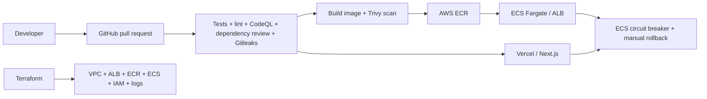

# Full DevSecOps Pipeline Demo

A small production-shaped monorepo showing security gates, immutable container deployment, infrastructure as code, and rollback—not merely a collection of workflow badges.

## Architecture



The backend is deployed to ECS Fargate behind an Application Load Balancer. The frontend is deployed to Vercel. GitHub authenticates to AWS with short-lived OIDC credentials; no long-lived AWS key is required.

## Run locally

Requirements: Python 3.12+, Node 22+, Docker (optional).

```bash
cp .env.example .env
python -m venv .venv
# activate the virtual environment, then:
pip install -e "api[dev]"
pytest api/tests
uvicorn app.main:app --app-dir api --reload

cd web
npm install
npm test -- --run
npm run dev
```

Or run both services with `docker compose up --build`. Open the UI at http://localhost:3000 and API docs at http://localhost:8000/docs.

## Pipeline behavior

`ci.yml` runs on pushes and pull requests:

- backend Ruff and pytest with coverage;
- frontend ESLint, TypeScript, Vitest, and production build;
- CodeQL static analysis for Python and JavaScript/TypeScript;
- dependency review on pull requests plus `pip-audit` and `npm audit` on every run;
- Gitleaks secret detection over the full checkout;
- a Docker build and Trivy vulnerability scan, uploading SARIF to GitHub Security.

`deploy.yml` runs after CI succeeds on `main`, or manually. It builds the API image, blocks on Trivy HIGH/CRITICAL findings, pushes an immutable commit-SHA tag to ECR, registers a new ECS task definition revision, waits for service stability, smoke-tests `/health`, and deploys the web app to Vercel. ECS has a deployment circuit breaker with automatic rollback.

`rollback.yml` is a manual break-glass workflow. Leave inputs blank to roll ECS back one task-definition revision and Vercel back to its previous production deployment, or provide explicit targets. GitHub's `production` environment should require reviewers.

## One-time setup

1. Create an S3 bucket and DynamoDB lock table for Terraform state, then update `infra/terraform/backend.tf`.
2. From `infra/terraform`, copy `terraform.tfvars.example` to `terraform.tfvars` and set values. Run `terraform init`, then `terraform apply -target=aws_ecr_repository.api` to break the first-deploy bootstrap cycle. Build and push `api/Dockerfile` to that ECR repository with an immutable `bootstrap` tag, set its full URI as `container_image`, then run `terraform apply`.
3. Add Terraform output `github_actions_role_arn` as repository variable `AWS_ROLE_ARN`.
4. Add repository variables `AWS_REGION`, `ECS_CLUSTER`, `ECS_SERVICE`, `ECS_TASK_FAMILY`, `ECR_REPOSITORY`, and `NEXT_PUBLIC_API_URL` (the ALB output plus `/api` only if routes change).
5. Add Vercel secrets `VERCEL_TOKEN`, `VERCEL_ORG_ID`, and `VERCEL_PROJECT_ID`.
6. Create a protected GitHub environment named `production` with required reviewers and restrict it to `main`.

The Terraform GitHub trust is deliberately scoped to this repository. For stronger production isolation, split infrastructure provisioning into a separate role and restrict the deploy role to ECR/ECS actions only.

## Rollback model

- **Automatic API rollback:** ECS deployment circuit breaker returns to the last successful service revision if tasks cannot become healthy.
- **Workflow rollback:** if ECS deployment or smoke testing fails, the deploy job restores the task definition captured before deployment.
- **Operator rollback:** Run the `Rollback production` workflow with an optional ECS task-definition ARN and Vercel deployment URL.

## Cost and teardown

The ALB, NAT gateway, Fargate tasks, ECR storage, and CloudWatch logs incur AWS charges. The demo defaults to one task and one NAT gateway. Run `terraform destroy` when finished.
